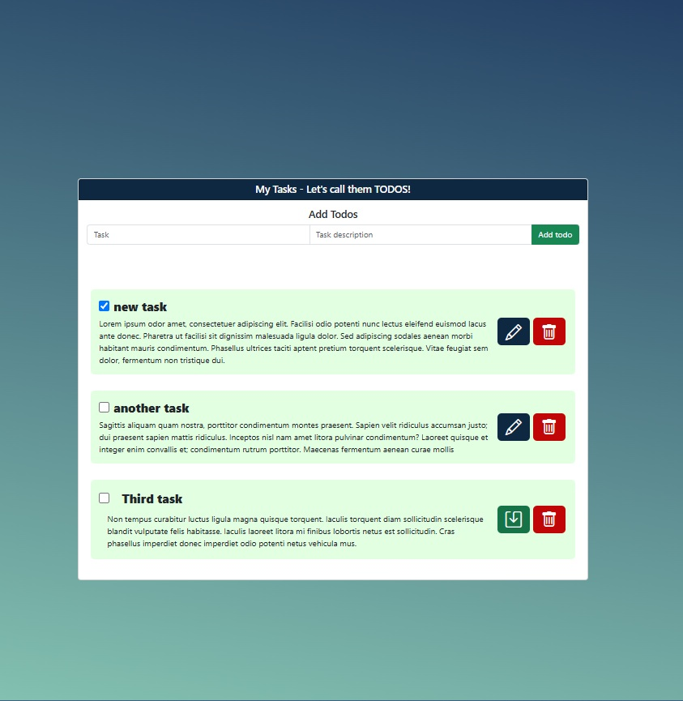

# To Do App


An application where users can add, delete or mark as done different daily tasks.

## Table of Contents

- [Installation](#get_started)
- [Technology](#technology)
- [Author](#author)
- [Future Functionalities](#future_functionalities)
- [Support](#support)

## Screenshot



## Live version

For the live version of this project please visit the following [link]()

## Get_started

```bash
    git clone git@github.com:Mesi14/to-do-app.git
    cd into the folder by typing: cd to-do-app
    open index.html in the browser
```

## Technology

- JavaScript ES6
- HTML
- CSS

## Author :bust_in_silhouette:

- [Mesi](https://github.com/Mesi14)

## Future_Functionalities:

- local storage

## Support

Give a :star: if you liked the page